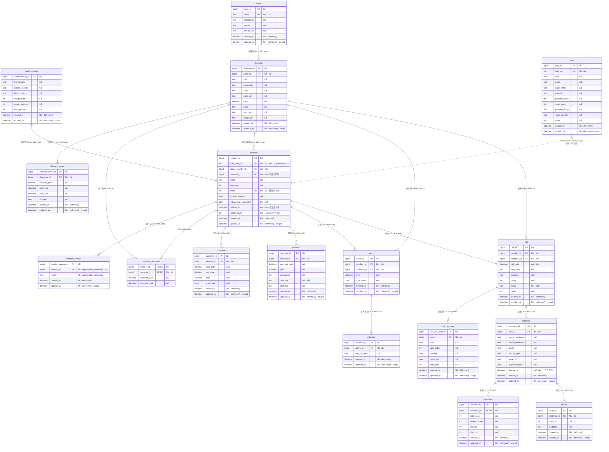

# BeaverTalk 엔티티 관계도 (ERD)

전체 도메인(account / commerce / alarm / learning)의 ORM 모델과 관계.
소프트 삭제 필드(`deleted_at`)는 `member`, `sentence` 두 곳에 있음.

> GitHub·VS Code(Mermaid 확장)·Obsidian 등에서 아래 다이어그램이 그려집니다.

## 관계 요약

| 부모 | 자식 | 카디널리티 | 삭제 정책 | 비고 |
|---|---|---|---|---|
| speak_country | member | 1:N | SET NULL | 억양 |
| character | member | 1:N | SET NULL | 대표 캐릭터 |
| member | member_reason | 1:N | CASCADE | 온보딩 학습이유 |
| member ↔ character | member_character | M:N | member=CASCADE, character=RESTRICT | 보유 캐릭터(복합 PK) |
| voice | character | 1:N | SET NULL | 통화 음성 |
| character | discount_event | 1:N | CASCADE | 할인행사 |
| member | subscribe | 1:N | CASCADE | 구독 |
| member | payment | 1:N | CASCADE | 결제 |
| member | alarm | 1:N | CASCADE | 알람 |
| character | alarm | 1:N | RESTRICT | 알람 캐릭터 |
| alarm | schedule | 1:N | CASCADE | 반복 요일 |
| member | call | 1:N | CASCADE | 통화 |
| character | call | 1:N | RESTRICT | 통화 상대 |
| call | call_raw_data | 1:N | CASCADE | 원본 턴 |
| call | sentence | 1:N | CASCADE | 발화 |
| sentence | evaluation | 1:1 | CASCADE | UNIQUE FK |
| sentence | review | 1:N | CASCADE | 복습 |
| level | member | (논리) | — | member.korean_level = level.level_no, **DB FK 없음** |

## 참고

- **소프트 삭제**: `member.deleted_at`, `sentence.deleted_at`. 값이 있으면 탈퇴/삭제된 행. 회원 탈퇴 시 `member`는 하드 삭제하지 않고 `deleted_at`을 찍으며 `email`·`auth_user_id`를 NULL로 비운다(같은 이메일 재가입 허용). 자식 데이터(call·subscribe 등)는 CASCADE로 지워지지 않고 보존된다.
- **RESTRICT** 관계(character→alarm/call/member_character)는 참조가 남아 있으면 캐릭터를 못 지운다(마스터 데이터 보호).
- `level`은 FK 없이 `korean_level` 숫자값으로만 연결되는 마스터 데이터.
